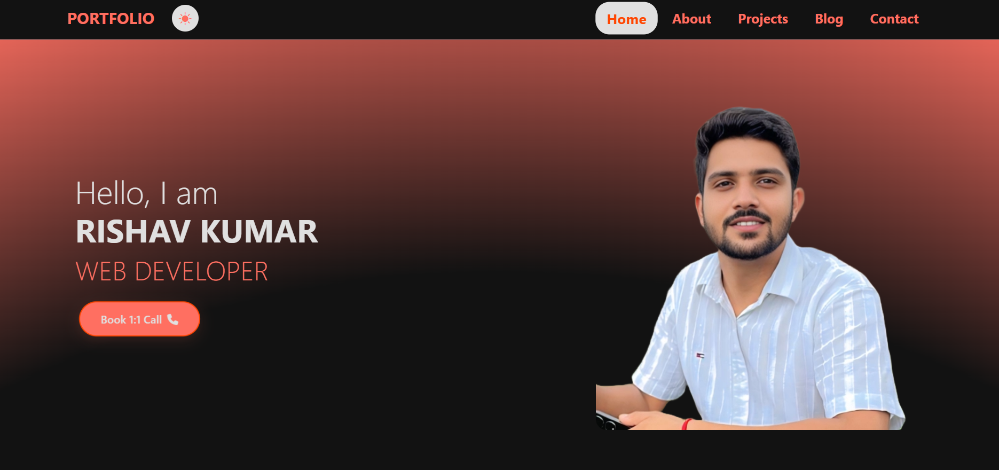

<h1 align="center">🌐 Rishav Kumar — Portfolio Website 🚀</h1>

<p align="center">
  <a href="https://rishav-kumar-portfolio.netlify.app/" target="_blank">
    
  </a>
  <a href="https://github.com/Rishabh0770/rishav-portfolio" target="_blank">
    
  </a>
  
</p>

---

## ✨ About Me

> 👋 Hey there! I’m **Rishav Kumar**, a **Computer Science & Engineering graduate** and an aspiring **Full-Stack Web Developer**.  
> This is my personal portfolio website where I showcase my skills, projects, and journey as a dev in public.  
> Built from scratch with ❤️ using **HTML, CSS, Bootstrap, JavaScript**, and deployed via **Netlify**.

---

## 🌍 Live Site

🔗 **Check it out here** → [rishav-kumar-portfolio.netlify.app](https://rishav-kumar-portfolio.netlify.app)

---

## 🖼️ Preview

<p align="center">
  
</p>

> You can replace this with more screenshots or a GIF walkthrough later!

---

## 🛠️ Tech Stack & Tools

| Tech | Description |
|------|-------------|
| ⚙️ **Frontend** | HTML5, CSS3, JavaScript |
| 🎨 **Styling** | Bootstrap 5, Google Fonts, AOS |
| 💾 **Backend-Ready** | PHP, MySQL (planned) |
| 🛠️ **Tools** | VS Code, Git, GitHub, Netlify |

---

## 🚀 Features

- 📱 **Responsive Design** — Mobile-first, fully responsive layout
- 🧠 **Interactive UI** — Animated transitions and AOS scroll effects
- 🌗 **Dark Mode** — Light/Dark toggle with theme persistence
- 🧑‍💼 **Projects Section** — Showcasing live apps and GitHub links
- 📬 **Contact Form** — Form validation (backend ready!)
- ✨ **Modern Design** — Clean layout and smooth UX

---

## 📂 Folder Structure

```bash
rishav-portfolio/
├── assets/
│   ├── css/
│   ├── js/
│   ├── images/
│   └── screenshots/
├── index.html
├── about.html
├── projects.html
├── contact.html
└── README.md
